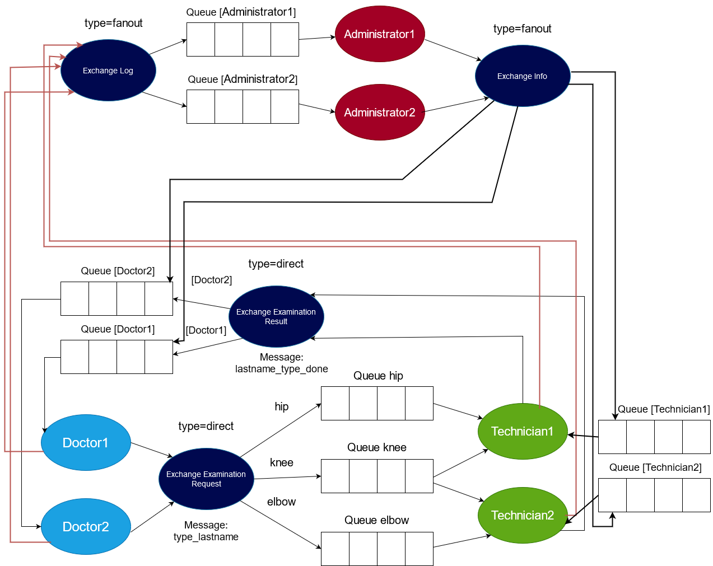

# Zadanie - RabbitMQ

## Zadanie zostało napisane w języku Java.

### Aby uruchomić Doktora (Doctor) należy użyć komendy:

```bash
    ./gradlew --console plain runDoctor --args "doctorName"
```
gdzie "doctorName" to nazwa Doktora


### Aby uruchomić Technika (Technician) należy użyć komendy:

```bash
  ./gradlew --console plain runTechnician --args "technicianName type1 type2"
```
gdzie "technicianName" to nazwa technika, a type1 i type2 to typy badań (HIP, KNEE, ELBOW)


### Aby uruchomić Administratora (Administrator) należy użyć komendy:

```bash
  ./gradlew --console plain runAdministrator --args "administratorName"
```
gdzie "administratorName" to nazwa administratora


# Schemat:




## Dostępne komendy (Doktor):

* ### [type]_[lastname] :
  Wysyła zlecenie badania o typie [type] (HIP, KNEE, ELBOW) oraz nazwisku pacjenta [lastname] 
* ### exit :
  Kończy działanie programu

## Dostępne komendy (Technik):

* ### exit :
  Kończy działanie programu

## Dostępne komendy (Administrator):

* ### [message] :
  Wysyła wiadomość [message] do wszystkich 
* ### exit :
  Kończy działanie programu
